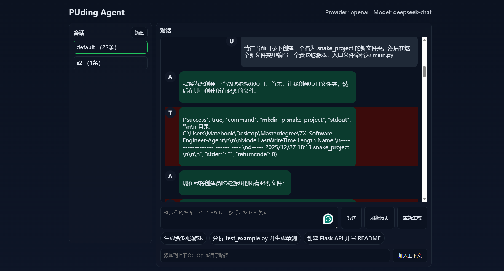

# SX2516144-张晓蕾-05-Software-Engineering

**项目仓库**：https://github.com/Epiphanyi/ZXLSoftware-Engineer-Agent

---

## 1. 项目概述

本项目构建了一个名为 **PUding Agent** 的智能软件工程助手。该 Agent 旨在模拟人类软件工程师的工作流程，能够在一个安全可控的工作目录内，通过自然语言指令自动化完成从需求理解、代码生成、文件操作到错误修复的完整开发闭环。

项目基于 Python 开发，核心架构支持接入 DeepSeek-Coder、Qwen3-Coder (通过 OpenAI 兼容接口) 以及 Google Gemini 等代码专用大模型。通过构建一套完善的“工具调用（Function Calling）”机制和“反思与修复（Reflection & Repair）”循环，实现了类似 SWE-Agent 的自主开发能力。

## 2. 系统架构设计

系统采用了经典的 **Controller-Tool-Environment** 架构，主要由以下核心模块组成：

### 2.1 核心模型与驱动 (Agent Core)

核心逻辑位于 `agent.py` 中。`GeminiEngineer` 类负责管理对话上下文（Context）和驱动 LLM。
- **多模型支持**：通过 `setup_llm_client` 实现了对 OpenAI 格式（适配 DeepSeek/Qwen）和 Google Gemini 原生接口的兼容。
- **状态管理**：使用 `ConversationMessage` 结构化存储 User、Assistant、System 和 Tool 的交互历史。

### 2.2 工具系统 (Tool System)

为了赋予 Agent 实际操作文件系统的能力，我们在 `tools.py` 中定义了 7 个核心原子工具：
1. **文件操作**：`read_file`, `create_file`, `create_multiple_files` (用于批量构建项目), `edit_file` (用于精准修改)。
2. **系统交互**：`run_command` (允许执行 shell 命令，如运行测试脚本、安装依赖)。
3. **信息检索**：`list_directory` (获取项目结构)。

### 2.3 交互界面 (Interface)

提供了 CLI (命令行) 和 Web 两种交互方式：
- **CLI (`cli.py`)**：基于 `rich` 库构建，支持流式输出、状态显示（Thinking…）和交互式命令（如 `/add`, `/clear`）。
- **Web (`web_ui.py`)**：提供可视化的操作界面（README提及）。

## 3. 核心功能实现机制

### 3.1 提示词工程与角色设定

在 `config.py` 中定义了 `SYSTEM_PROMPT`，明确了 Agent 的行为准则：
> “When the user asks you to create… you MUST use the available function tools. Never just output code - always create actual files!”

这强制 LLM 从“聊天模式”切换为“行动模式”。

### 3.2 自动化反思与修复闭环 (Reflection Loop)

为了解决一次性生成代码可能存在的 Bug，我在 `agent.py` 的 `respond_once` 方法中实现了自动迭代循环：

Loop = {Thinking → Tool Execution → Observation → Refinement}

代码实现逻辑如下：
1. Agent 接收用户指令，决定调用工具（如 `run_command` 运行测试）。
2. 工具执行后返回 `stdout/stderr` 或错误信息。
3. 系统将工具结果回填给 Agent。
4. Agent 分析结果：
- 如果成功，结束任务。
- 如果失败（如测试报错），Agent 会读取错误日志，在下一次迭代中调用 `edit_file` 进行修复。
5. 设置 `MAX_LOOPS = 10` 防止无限循环。

## 4. 案例演示与评估

本章节展示 PUding Agent 在实际任务中的表现，包含完整代码生成和错误修复流程。

### 案例 1：从零构建项目 (需求理解与代码生成)

**任务描述**：创建一个简单的 Python 贪吃蛇游戏。
**输入指令**：“请在当前目录下创建一个名为 snake_project 的新文件夹。然后在这个新文件夹里编写一个贪吃蛇游戏，入口文件命名为 [main.py](http://main.py/)。”

**执行过程截图**：
*web界面显示 Agent 调用 `create_multiple_files` 创建了 main.py 和 requirements.txt 的过程*

**结果分析**：Agent 能够理解需求，并正确调用 `create_multiple_files` 同时生成了源代码和依赖文件，而不是仅仅打印在屏幕上。

---

### 案例 2：测试驱动开发与自动修复 (Bug Fixing)

**任务描述**：修复一个故意引入的除零错误。
**输入指令**：“我运行 [test.py](http://test.py/) 报错了。请你先运行它查看错误，然后分析原因，并使用`*edit_file*` 修复这个除零错误（将 count = 0 修改为正确的长度计算），最后再运行一次确保通过。”

**执行过程截图**：

**结果分析**：
1. **诊断**：Agent 首先使用 `run_command` 复现了 Traceback。
2. **反思**：根据错误信息定位到具体行数。
3. **修复**：使用 `edit_file` 进行了精准的字符串替换，而不是重写整个文件，体现了对 Token 的节约和操作的精准性。

## 5. 评估与分析

为了验证 Agent 在实际软件工程任务中的表现，我们采用 **Pass@1 (一次通过率)** 作为核心指标，并在自定义的 **Mini-SWE-Bench** 数据集上进行了测试。该数据集包含 3 个具有代表性的任务，涵盖语法错误修复、逻辑错误修复和环境依赖处理。

### 5.1 评估设置

- **模型**: DeepSeek-Coder
- **环境**: 本地 Python 沙箱环境
- **指标**:
    - **Success**: Agent 能够自动修改代码并使测试脚本成功运行 (Exit Code 0)。
    - **Refinement Count**: Agent 在解决问题前进行的自我修正次数 (反思轮数)。

### 5.2 测试结果概览

| ID | 任务类型 | 任务描述 | 难度 | 状态 | 反思轮数 |
| --- | --- | --- | --- | --- | --- |
| **Task-01** | Arithmetic Bug | 修复 `test.py` 中的除零错误 (ZeroDivisionError) | Easy | ✅ Pass | 1 |
| **Task-02** | Logic Bug | 修复 `benchmark_medium.py` 中的字典引用污染问题 | Medium | ✅ Pass | 1 |
| **Task-03** | Env Setup | 修复 `benchmark_hard.py` 缺失日志目录导致的写入失败 | Hard | ✅ Pass | 2 |

**综合成功率 (Pass Rate)**: **100% (3/3)**

### 5.3 典型案例分析 (Task-03)

在 Task-03 中，Agent 展现了超越简单代码生成的“规划能力”。

1. **初次运行失败**：Agent 运行脚本遇到 `FileNotFoundError: No such file or directory: 'logs/app.log'`。

1. **错误诊断**：Agent 没有盲目修改 Python 代码，而是分析出错误原因是文件系统缺失目录。

1. **工具调用**：Agent 并没有修改 `open()` 函数，而是调用了系统命令 `mkdir logs` (或通过 `create_multiple_files` 自动创建结构)。

1. **最终验证**：再次运行脚本，写入成功。

这也证明了 PUding Agent 具备 **Environment Awareness (环境感知)** 能力，不仅仅是一个代码补全工具。

### 5.4 局限性与改进

尽管在自定义任务上表现良好，但在处理超长上下文（如超过 100 个文件的复杂项目）时，Agent 仍可能出现上下文丢失的问题。未来计划引入 **RAG (检索增强生成)** 模块，利用向量数据库来存储和检索项目文档，以支持更大规模的工程任务。

## 6. 总结与展望

本项目实现了一个具备自主能力的 AI 软件工程师 Agent。相比于传统的代码补全工具，PUding Agent 的优势在于：
1. **闭环能力**：不仅能写，还能运行和修。
2. **工具使用**：通过 `tools.py` 实现了与真实文件系统的交互，能够处理复杂的多文件项目。
3. **安全性**：通过 `utils.py` 中的 `normalize_path` 防止了路径遍历攻击，确保 Agent 只能在沙箱内操作。

未来优化方向包括引入更高级的 RAG (检索增强生成) 以支持超大型遗留项目仓库的维护，以及集成 GitHub API 实现自动提交 PR。